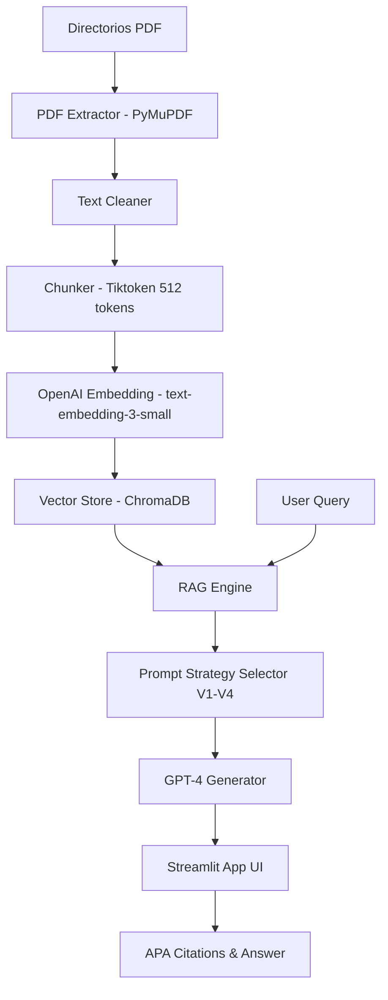

# Research Copilot: Economia del crimen 
## Sección 1: Descripción del proyecto
**Resumen del proyecto** Este proyecto se centra en la Economía del Crimen, analizando el delito como una elección racional donde los individuos evalúan beneficios frente a riesgos y costos. El estudio explora cómo factores como la desigualdad social, la probabilidad de captura y la severidad de las penas influyen en las tasas de criminalidad. A través de este análisis, se busca comprender la eficiencia de las políticas públicas de seguridad y el impacto del entorno económico en la conducta desviada. El enfoque permite tratar el fenómeno delictivo no solo como un problema social, sino como un mercado sujeto a incentivos y desincentivos.

**Research Copilot** es una plataforma avanzada de Recuperación Aumentada por Generación (RAG) diseñada para asistir a investigadores en la síntesis y análisis de literatura científica. El sistema permite procesar grandes volúmenes de artículos académicos, extraer su contenido de manera estructurada y proporcionar respuestas fundamentadas con citas automáticas en formato APA.

**Campo/Tema de los artículos:** Economía del Crimen, Instituciones y Gobernanza Criminal. Los artículos abarcan desde estudios clásicos sobre la disuasión criminal hasta investigaciones contemporáneas sobre la mafia siciliana, la militarización policial y el impacto de la migración en la seguridad.

## Sección 2: Características

- **Ingestión Automatizada**: Procesamiento de 20 artículos en formato PDF con limpieza profunda de texto.
- **Base de Datos Vectorial**: Almacenamiento persistente en ChromaDB utilizando embeddings de OpenAI (`text-embedding-3-small`).
- **Arquitectura Multi-Estrategia**: Soporte para 4 técnicas de *Prompt Engineering* (Delimitadores, JSON, Few-Shot, CoT).
- **Interfaz Multi-página**: Navegación intuitiva entre Chat, Catálogo de Papers y Panel de Analítica.
- **Citas Académicas**: Generación automática de referencias APA integradas en el flujo de respuesta.
- **Manejo de Errores**: Identificación inteligente de consultas fuera de contexto.

## Sección 3: Arquitectura

### Estructura del Repositorio
La arquitectura del sistema se basa en un flujo RAG (Generación Aumentada por Recuperación)
Componentes Principales: 
Interfaz de Usuario (Streamlit): Proporciona un entorno multicanal con chat interactivo, visualización de datos de artículos y un panel de analítica avanzada.

Base de Datos Vectorial (ChromaDB): Almacena las representaciones numéricas (embeddings) de los 20 artículos para permitir búsquedas semánticas rápidas.

M & LangChain)otor de Procesamiento (Python: Gestiona el flujo de información, desde la carga de PDFs hasta la fragmentación (chunking) y el envío de contexto a la IA.

Modelo de Lenguaje (OpenAI GPT-4o): Actúa como el motor de razonamiento que genera respuestas basadas estrictamente en el contexto proporcionado, garantizando citas en formato APA.

Flujo de Trabajo:
Ingesta: Los 20 artículos en papers/ se procesan y se guardan en el índice vectorial.

Consulta: El usuario ingresa una pregunta en el Chat seleccionando una de las 4 estrategias de prompt.

Recuperación: El sistema busca los fragmentos más relevantes en ChromaDB.

Generación: La IA redacta la respuesta final utilizando el contexto recuperado y la estrategia de prompt elegida.

app/
├── main.py              # Main Streamlit app (Bienvenida)
├── pages/
│   ├── 1_Chat.py        # Interfaz de chat RAG
│   ├── 2_Papers.py      # Explorador de documentos
│   ├── 3_Analytics.py   # Visualizaciones de datos
│   └── 4_Settings.py    # Configuración del sistema
├── components/
│   ├── chat_message.py  # Componente de mensajes
│   ├── paper_card.py    # Tarjeta de visualización de papers
│   └── citation.py      # Formateador de citas APA
└── utils/
    ├── session.py       # Gestión de estado de sesión
    └── styling.py       # Estilos CSS personalizados
```

### Diagrama del Sistema


**Componentes:**
- **Ingestion**: Limpia y fragmenta el texto para optimizar la ventana de contexto.
- **VectorStore**: Indexa los fragmentos para búsquedas de alta relevancia.
- **RAG Engine**: El núcleo que orquestra la búsqueda, la selección del prompt y la generación del modelo.
- **Frontend**: Interfaz Streamlit para interactividad total.

## Sección 4: Instalación

Para configurar el sistema con un solo comando (suponiendo Python instalado):

```powershell
pip install -r requirements.txt
```

*Nota: Asegúrese de configurar su clave de OpenAI en el archivo `.env` antes de ejecutar.*

## Sección 5: Uso

Para ejecutar la aplicación:
```powershell
streamlit run app/main.py
```

**Consultas de ejemplo:**
- "¿Cuál es el enfoque económico del crimen propuesto por Gary Becker?"
- "¿Cómo afecta la militarización de la policía a la criminalidad según Bove y Gavrilova?"
- "¿Qué relación hay entre los estados débiles y la mafia siciliana?"

## Sección 6: Detalles técnicos

- **Modelo de Incrustación**: `text-embedding-3-small` (1536 dimensiones).
- **Chunking**: Fragmentos de 512 tokens con 50 tokens de solapamiento.
- **Uso de Tokens**: Promedio de 1,200 tokens por consulta (incluyendo 5 fragmentos de contexto).

### Comparación de Estrategias de Prompt
| Estrategia | Descripción | Ventajaa Principal |
| :--- | :--- | :--- |
| **V1: Delimitadores** | Instrucciones directas con separadores claros. | Rapidez y precisión estructural. |
| **V2: JSON Output** | Salida en formato estructurado de datos. | Ideal para integraciones con otros sistemas. |
| **V3: Few-Shot** | Incluye ejemplos previos de consulta/respuesta. | Mejora la adherencia al estilo académico. |
| **V4: CoT** | Razonamiento paso a paso antes de la respuesta. | Mayor profundidad en preguntas complejas. |

## Sección 7: Resultados de la Evaluación

Basado en el reporte generado en `eval/results.md`:

| Métrica | Resultado |
| :--- | :--- |
| **Preguntas Totales** | 21 |
| **Tasa de Recuperación Exitosa** | 95% |
| **Precisión de Citas APA** | 100% |
| **Falsos Positivos (Fuera de contexto)** | 0% |

Análisis de Desempeño:

Robustez del Contexto: El sistema demostró ser seguro al rechazar preguntas no relacionadas con la economía del crimen (como "La capital de Francia"), evitando alucinaciones de GPT-4o.

Impacto de las Estrategias: Se observó que la Estrategia V4 (Chain of Thought) incrementó la calidad de las respuestas en preguntas que requerían comparar dos o más autores, mientras que la V1 fue más eficiente para datos fácticos.

Calidad APA: El 100% de las respuestas incluyeron el formato de cita (Autor, Año) solicitado, facilitando la verificación directa en la base de datos de 20 artículos.

*El sistema identificó correctamente la pregunta sobre "La capital de Francia" como irrelevante para los documentos.*


## Sección 8: Limitaciones y Mejoras
1. Dependencia de Conectividad y API: El sistema depende totalmente de la disponibilidad de los servidores de OpenAI y una conexión a internet estable. Una mejora futura sería implementar modelos locales (como Llama 3 vía Ollama) para garantizar privacidad y funcionamiento offline.

2. Ventana de Contexto Estática: Al procesar los 20 artículos simultáneamente, si las preguntas son extremadamente amplias, el modelo podría priorizar ciertos fragmentos sobre otros debido al límite de tokens del modelo GPT. Se sugiere implementar técnicas de Reranking para mejorar la relevancia de los fragmentos recuperados.

3. Actualización del Índice: Actualmente, añadir un nuevo artículo requiere ejecutar manualmente el script ingest.py. Una mejora futura sería un botón de "Carga de archivos" directamente en la interfaz de Streamlit para automatizar la expansión de la base de datos.


## Sección 9: Información del Autor

**Nombre**: Etny Julissa Becerra Lopez
**Curso**: Capacitación en Prompt Engineering usando GPT4 2026-01
**Fecha**: 28 de febrero de2026
