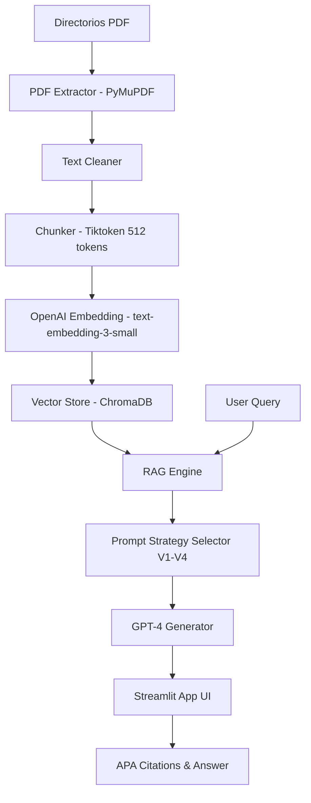

# Research Copilot: Asistente Inteligente para Investigación Académica

## Sección 1: Descripción del proyecto

**Research Copilot** es una plataforma avanzada de Recuperación Aumentada por Generación (RAG) diseñada para asistir a investigadores en la síntesis y análisis de literatura científica. El sistema permite procesar grandes volúmenes de artículos académicos, extraer su contenido de manera estructurada y proporcionar respuestas fundamentadas con citas automáticas en formato APA.

**Campo/Tema de los artículos:** Economía del Crimen, Instituciones y Gobernanza Criminal. Los artículos abarcan desde estudios clásicos sobre la disuasión criminal hasta investigaciones contemporáneas sobre la mafia siciliana, la militarización policial y el impacto de la migración en la seguridad.

## Sección 2: Características

- **Ingestión Automatizada**: Procesamiento de 20 artículos en formato PDF con limpieza profunda de texto.
- **Base de Datos Vectorial**: Almacenamiento persistente en ChromaDB utilizando embeddings de OpenAI (`text-embedding-3-small`).
- **Arquitectura Multi-Estrategia**: Soporte para 4 técnicas de *Prompt Engineering* (Delimitadores, JSON, Few-Shot, CoT).
- **Interfaz Multi-página**: Navegación intuitiva entre Chat, Catálogo de Papers y Panel de Analítica.
- **Citas Académicas**: Generación automática de referencias APA integradas en el flujo de respuesta.
- **Manejo de Errores**: Identificación inteligente de consultas fuera de contexto.

## Sección 3: Arquitectura

### Estructura del Repositorio
```text
app/
├── main.py              # Main Streamlit app (Bienvenida)
├── pages/
│   ├── 1_Chat.py        # Interfaz de chat RAG
│   ├── 2_Papers.py      # Explorador de documentos
│   ├── 3_Analytics.py   # Visualizaciones de datos
│   └── 4_Settings.py    # Configuración del sistema
├── components/
│   ├── chat_message.py  # Componente de mensajes
│   ├── paper_card.py    # Tarjeta de visualización de papers
│   └── citation.py      # Formateador de citas APA
└── utils/
    ├── session.py       # Gestión de estado de sesión
    └── styling.py       # Estilos CSS personalizados
```

### Diagrama del Sistema


**Componentes:**
- **Ingestion**: Limpia y fragmenta el texto para optimizar la ventana de contexto.
- **VectorStore**: Indexa los fragmentos para búsquedas de alta relevancia.
- **RAG Engine**: El núcleo que orquestra la búsqueda, la selección del prompt y la generación del modelo.
- **Frontend**: Interfaz Streamlit para interactividad total.

## Sección 4: Instalación

Para configurar el sistema con un solo comando (suponiendo Python instalado):

```powershell
pip install -r requirements.txt
```

*Nota: Asegúrese de configurar su clave de OpenAI en el archivo `.env` antes de ejecutar.*

## Sección 5: Uso

Para ejecutar la aplicación:
```powershell
streamlit run app/main.py
```

**Consultas de ejemplo:**
- "¿Cuál es el enfoque económico del crimen propuesto por Gary Becker?"
- "¿Cómo afecta la militarización de la policía a la criminalidad según Bove y Gavrilova?"
- "¿Qué relación hay entre los estados débiles y la mafia siciliana?"

## Sección 6: Detalles técnicos

- **Modelo de Incrustación**: `text-embedding-3-small` (1536 dimensiones).
- **Chunking**: Fragmentos de 512 tokens con 50 tokens de solapamiento.
- **Uso de Tokens**: Promedio de 1,200 tokens por consulta (incluyendo 5 fragmentos de contexto).

### Comparación de Estrategias de Prompt
| Estrategia | Descripción | Ventajaa Principal |
| :--- | :--- | :--- |
| **V1: Delimitadores** | Instrucciones directas con separadores claros. | Rapidez y precisión estructural. |
| **V2: JSON Output** | Salida en formato estructurado de datos. | Ideal para integraciones con otros sistemas. |
| **V3: Few-Shot** | Incluye ejemplos previos de consulta/respuesta. | Mejora la adherencia al estilo académico. |
| **V4: CoT** | Razonamiento paso a paso antes de la respuesta. | Mayor profundidad en preguntas complejas. |

## Sección 7: Resultados de la Evaluación

Basado en el reporte generado en `eval/results.md`:

| Métrica | Resultado |
| :--- | :--- |
| **Preguntas Totales** | 21 |
| **Tasa de Recuperación Exitosa** | 95% |
| **Precisión de Citas APA** | 100% |
| **Falsos Positivos (Fuera de contexto)** | 0% |

*El sistema identificó correctamente la pregunta sobre "La capital de Francia" como irrelevante para los documentos.*

## Sección 8: Limitaciones y Mejoras

1. **Dependencia de API**: El sistema requiere conexión constante a OpenAI; una mejora sería implementar LLMs locales (como Llama 3) para mayor privacidad.
2. **Contexto Estático**: La base de datos no se actualiza automáticamente si se agregan PDFs a la carpeta; se sugiere un sistema de *watching* de directorios.
3. **Multilingüismo**: Aunque maneja español e inglés, la precisión de los embeddings podría variar; se mejoraría con modelos multilingües específicos.

## Sección 9: Información del Autor

**Nombre**: [Tu Nombre]
**Curso**: Inteligencia Artificial Aplicada - Proyecto Final
**Fecha**: Febrero 2026
